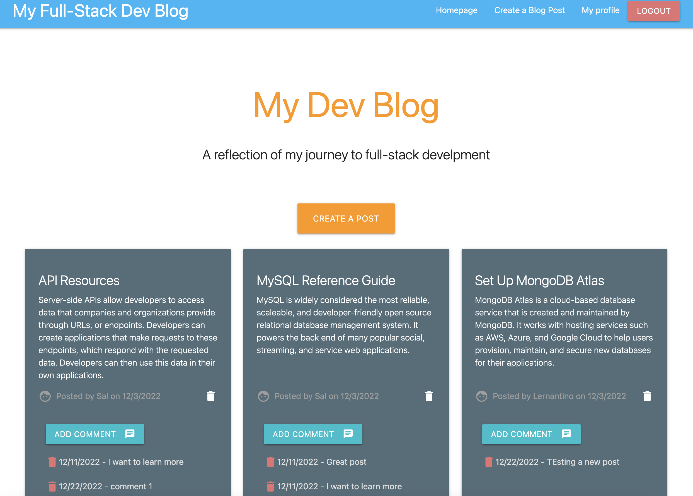
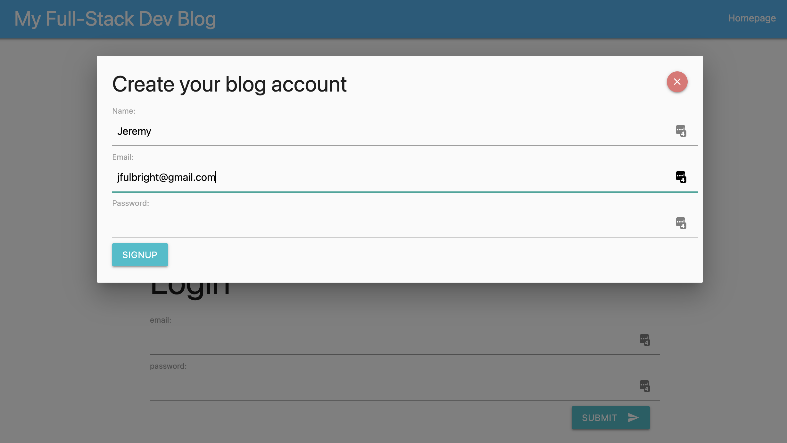
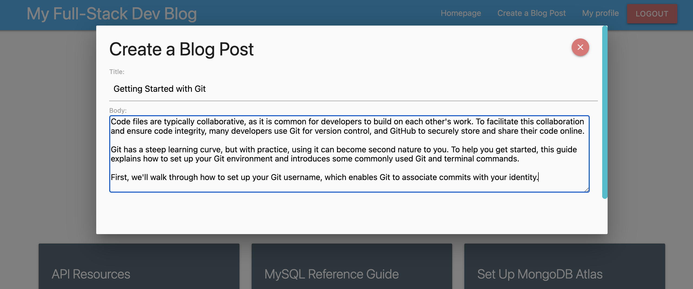
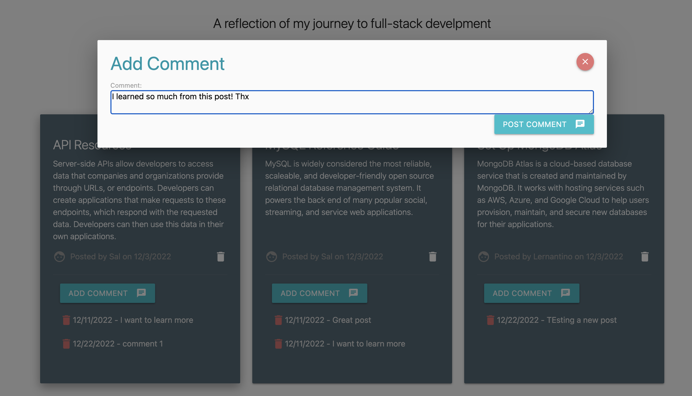

# MVC Tech Blog
  

## Description:
This is a CMS-style blog site similar to a Wordpress site, where developers can publish their blog posts and comment on other developers’ posts as well. I built this site completely from scratch and deployed it to Heroku. This app follows the MVC paradigm in its architectural structure, using Handlebars.js as the templating language, Sequelize as the ORM, and the express-session npm package for authentication.

## Table of Contents:
- [MVC Tech Blog](#mvc-tech-blog)
  - [Description:](#description)
  - [Table of Contents:](#table-of-contents)
  - [Screenshots](#screenshots)
  - [Installation](#installation)
  - [Usage](#usage)
  - [Credits](#credits)
  - [Questions](#questions)
  - [Contributing](#contributing)
  - [Tests](#tests)
  - [License](#license)

## Screenshots

## Installation
_________________
You’ll need to use the express-handlebars package to implement Handlebars.js for your Views, use the MySQL2 and Sequelize packages to connect to a MySQL database for your Models, and create an Express.js API for your Contr Controllers. You’ll also need the dotenv package to use environment variables, the bcrypt package to hash passwords, and the express-session and connect-session-sequelize packages to add authentication.

## Usage
_________________

## Credits
_________________
* 

## Questions
  _________________
  Contact me with any questions, comments or suggestions at:
* [GitHub.com/jfulbright](http://github.com/jfulbright)
* [jfulbright@gmail.com](mailto:jfulbright@gmail.com)
* [LinkedIn.com/in/jeremyfulbright](https://www.linkedin.com/in/jeremyfulbright)

## Contributing
_________________

## Tests
_________________
This project does not have test cases, but you should validate ability to create and delete blog posts, create and delete comments, add userss, and   authenticate. 

## License
_________________

* This project is licensed under the terms of the MIT license.
* [https://lbesson.mit-license.org/](https://lbesson.mit-license.org/)
* Legal Code: [LICENSE](LICENSE)

